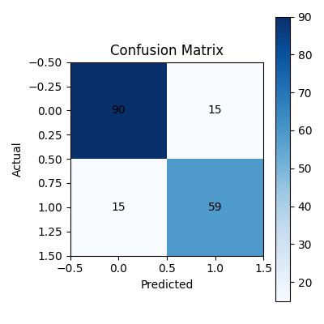
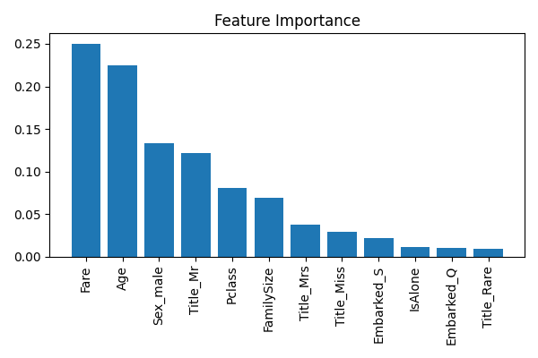

# Titanic-Insights-ML

🚢 **Titanic Survival Predictor** — a small friendly ML demo that trains a simple model on the Titanic dataset and exposes a Streamlit UI to try predictions.

**Live demo:** https://titanic-insights-ml-9o5fh88vhxgshekjtil9gt.streamlit.app/  
(Hosted on Streamlit Community Cloud — free demo)

---

## What this project does (short)
This repo:
- Loads the classic Titanic dataset.
- Performs basic preprocessing (fill missing, extract title, create family features, one-hot encoding).
- Trains a simple classifier and evaluates it.
- Saves evaluation figures (confusion matrix & feature importance).
- Provides a lightweight **Streamlit app** (`app.py`) so anyone can type passenger attributes and get a predicted survival probability.

It is a demo for learning model pipelines + deployment.

##  Project Highlights

- Clean modular ML pipeline (scikit-learn)
- Custom preprocessing (missing values, feature engineering, categorical handling)
- Feature importance visualization
- Confusion matrix to evaluate model performance
- Easily reproducible training script
- Organized folder structure used in real-world ML projects

---

## 📂 Project Structure
Titanic-Insights-ML/
│
├── src/
│ ├── data.py → Loads titanic.csv
│ ├── preprocess.py → Cleans & transforms the data
│ ├── model.py → Builds the ML model (Random Forest)
│ ├── evaluate.py → Generates metrics
│ └── train.py → Main training script
│
├── results/
│ ├── metrics.json
│ └── figures/
│ ├── confusion_matrix.png
│ └── feature_importance.png
│
├── app.py
├── titanic.csv
├── requirements.txt
└── .gitignore

---

## 🧠 Model Performance

| Metric      | Score      |
|-------------|------------|
| Accuracy    | **0.8324** |
| Precision   | **0.7973** |
| Recall      | **0.7973** |
| F1 Score    | **0.7973** |

📌 Full metrics available in: `results/metrics.json`

---

## 📊 Confusion Matrix

---

## 📈 Feature Importance

---

## 🛠️ How to Run Locally (Windows PowerShell)
git clone https://github.com/Murariji/Titanic-Insights-ML.git

cd Titanic-Insights-ML

python -m venv venv
venv\Scripts\activate

pip install -r requirements.txt

python -m src.train

python -m streamlit run app.py

This will:
- preprocess the dataset  
- train the model  
- save the model to `models/model.pkl`  
- generate evaluation results in `results/`  

---

## 🧩 Feature Engineering Used

- Title extraction from passenger names  
- Family size & IsAlone indicators  
- One-hot encoding for categorical features  
- Missing value imputation  
- Fare & Age normalization via median strategy  

---

## 📘 What This Project Demonstrates 

- Understanding of ML workflow  
- Ability to implement clean modular code (src/ structure)  
- Concept of evaluation metrics & trade-offs  
- Real-world preprocessing (title extraction, family size engineering)  
- Clear model explainability through feature importance  

---

## 🔮 Future Improvements

- Hyperparameter tuning (GridSearchCV / RandomizedSearchCV)  
- SHAP-based explainability  
- Add cross-validation  
- Try alternative models (XGBoost, Logistic Regression baseline)  

---

## ✨ About This Repo
This branch  contains the clean, production-ready version of the Titanic ML pipeline with proper structure, results, and documentation.

